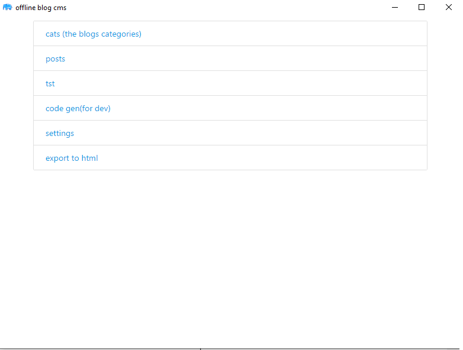
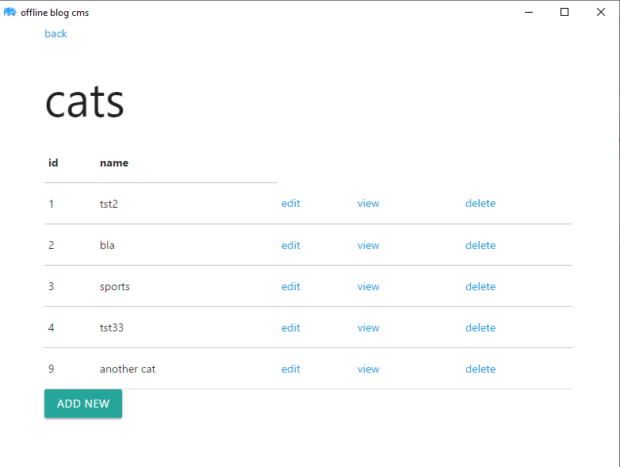
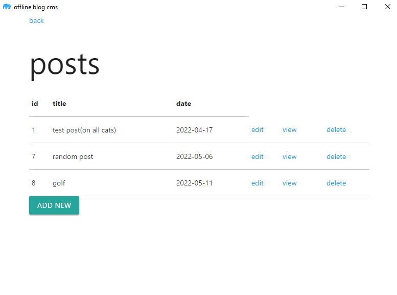
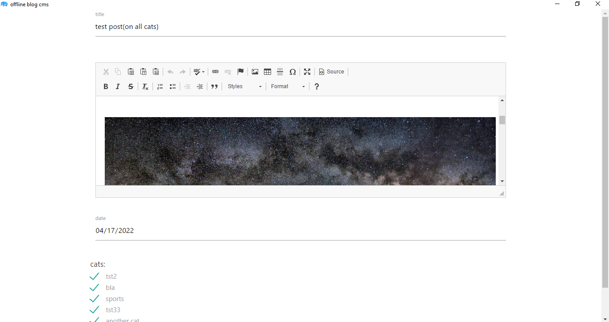
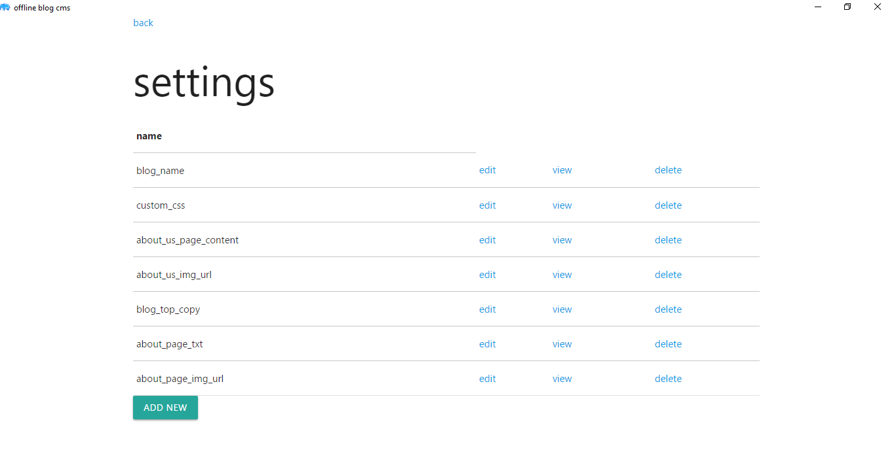
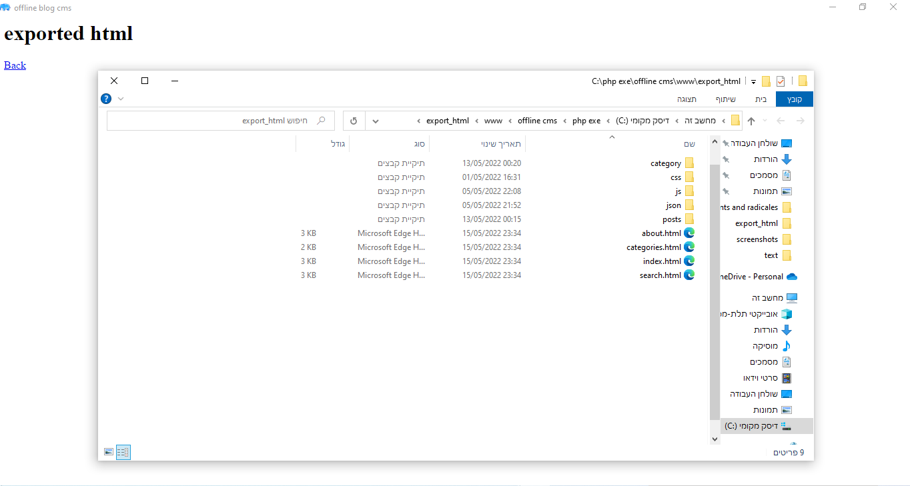
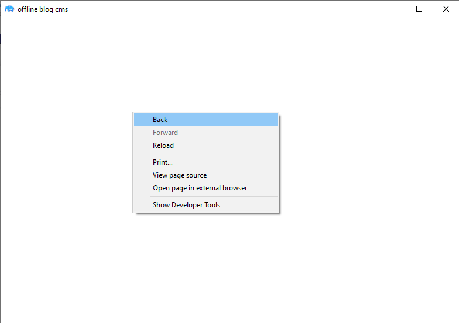

# offline cms using phpdesktop that genrates a static blog

its a php desktop application that lets you create a static blog.

the purpose: it is a proof of concept for creating a desktop app with php.
and a proof of concept for offline cms that creates a static website, can be used
for many perpuses a blog is the simplest so thats what i did.
the design is very minemal as thats not the focuse of this project.

it uses: 
-phpdesktop as server and browser
-the main programming languge is php
-for the front it uses matrilizecss
-for database it uses sqlite and jason for the static version (the exported blog)
-and it uses my own php framework for rapid dev
-the search post feature is js and json

##features:
*create update deleate read (crud) posts
*crud for categories
*crud for website settings (without deleate)
*template system
*export everything as a static html website
*my frameworks code genrator that lets me create boilerplate crud tables fast 

##how to use?

download the repo, extract all of the zip files, run the exe.

screenshots:

* hers a contact form:

https://ytutor.wordpress.com/console-based-space-station-game/

